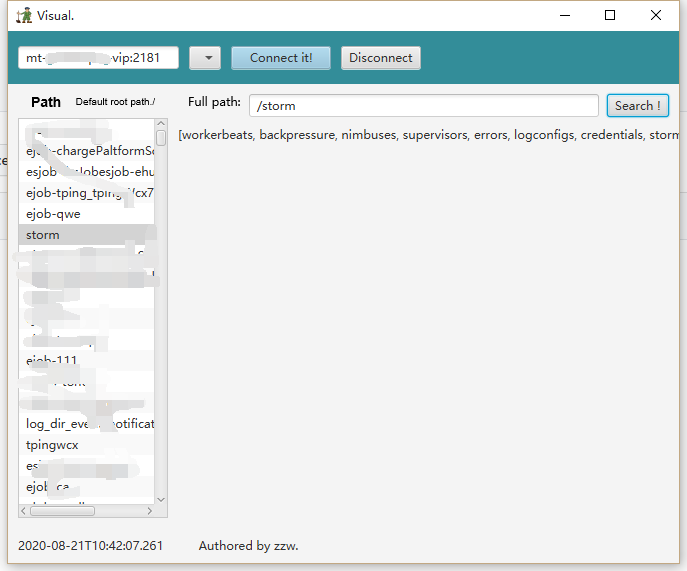

# Visuals
zookeeper的可视化桌面工具
使用简单：

```
java -jar zk_visual.jar
```
tips: 默认你已经有了java运行环境




- 输入zookeeper地址  
- 点击connect即可连接  
- 支持保持多个zk会话，在下拉列表选择  
- disconnect 断开当前会话连接  
- 点击左侧path列表里的任意路径，可在中间部分搜索框填充该root路径  
- 点击search可索搜该路径下的child列表  